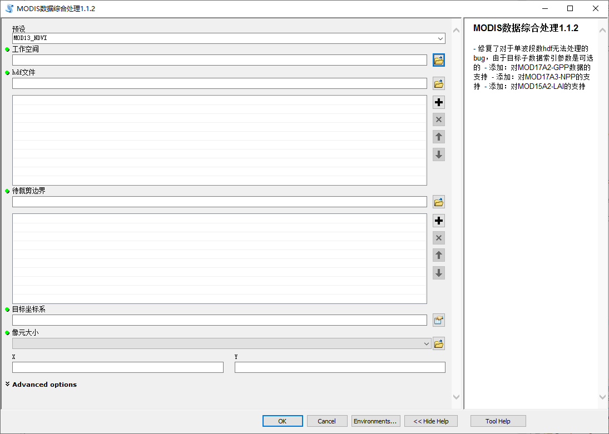

一款批量处理MODIS系列数据的工具，该工具基于ArcGIS的python工具箱实现：

该工具能够批量对MODIS原始数据文件（.hdf）进行提取子数据集、拼接、裁剪、投影栅格等操作，并根据选择的矢量文件裁剪得到对应区域的栅格文件（.tif）.

# 配置教程

# 使用教程
视频教程：[MODIS数据批量处理工具，一键完成拼接、裁剪，比MRT更快速](https://www.bilibili.com/video/BV1zf4y1Z7SJ)
文字教程：[【MODIS数据处理#14】拼接、投影、裁剪一键完成，比MRT更方便的ArcGIS脚本工具（含代码）](https://blog.csdn.net/qq_37948866/article/details/121209155)
# 联系方式
反馈邮箱：ygzh_concat@163.com

